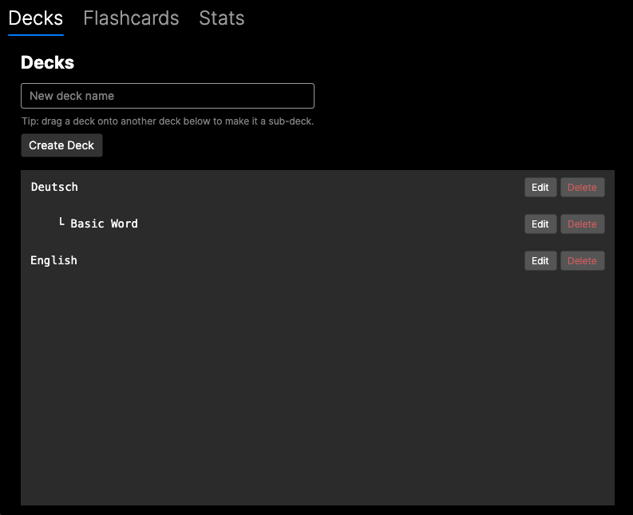
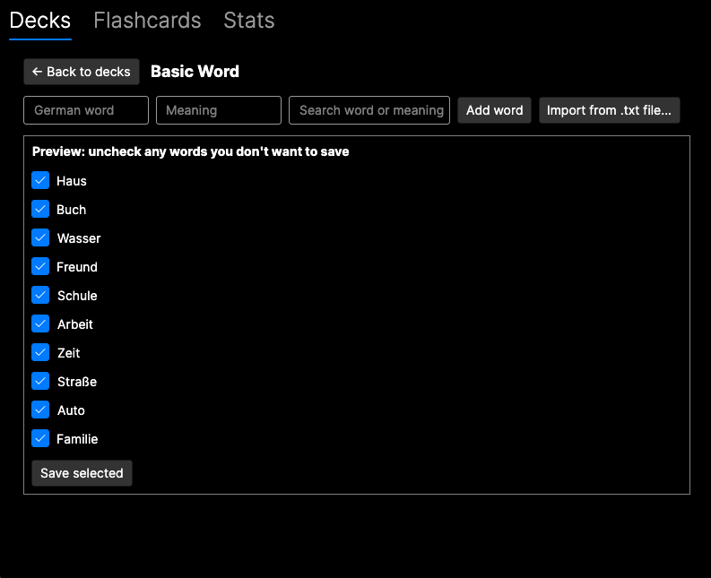
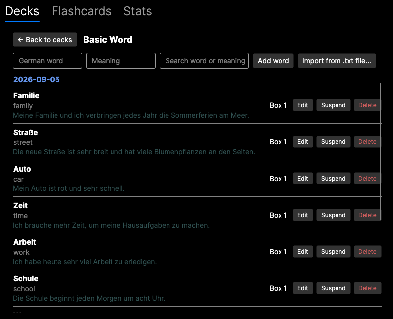
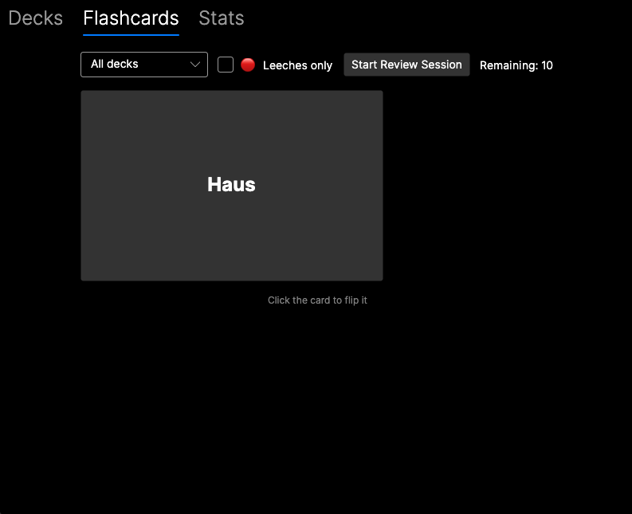
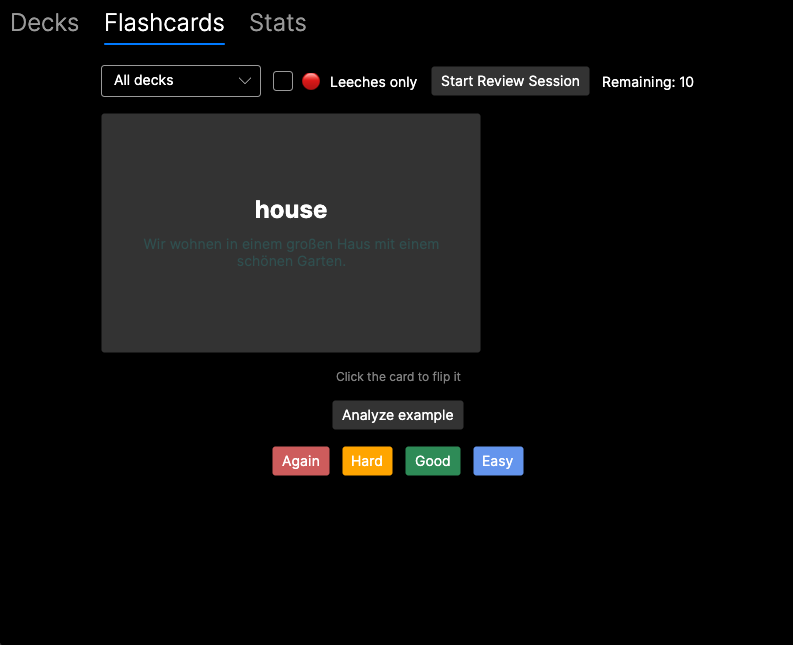
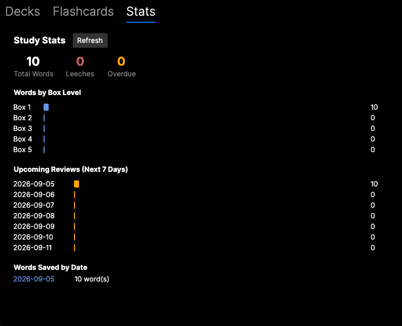

# German Study App

A desktop app for learning German vocabulary with an Anki-style spaced-repetition trainer, AI-generated example sentences, and on-demand AI grammar analysis. Built with C#/.NET and Avalonia UI, following a clean Core/Infrastructure/UI layered architecture.

This is both a personal study tool and a portfolio project. Every line in the `Core` and `Infrastructure` layers was written by hand (no scaffolding, no copy-pasted solutions) as a deliberate way to learn backend/.NET fundamentals from scratch. The UI layer was built with AI assistance to move faster, since the focus of this project is backend/domain logic.

## Features

**Decks**
- Nested decks (e.g. "German" containing "B1", "B2") with create/rename/delete.
- Click into a deck to open its own detail screen — similar to opening a folder in an IDE — showing only that deck's words.
- Drag and drop a deck onto another deck to make it a sub-deck, with cycle-prevention (can't drop a deck into its own sub-deck).

**Vocabulary**
- Add words one at a time from inside a deck (German word + meaning), or bulk import from a plain `.txt` file (`Word,Meaning` per line) with a preview/selection step before saving.
- Edit a saved word's German text or meaning later to fix typos.
- Word list grouped by the date added, with live search by word or meaning.
- When a word is saved, an example sentence in German is generated automatically by the OpenAI API (CEFR level configurable).

**Flashcard review (Leitner system)**
- 4-level review grading (Again / Hard / Good / Easy) instead of simple right/wrong, closer to real spaced-repetition scheduling.
- The card back shows the meaning and the AI-generated example sentence.
- Optional "Analyze example" button runs on-demand AI grammar analysis on that sentence: verb forms, separable verbs, article/gender reasoning, adjective declension, and a natural + literal translation.
- Leech detection: words that keep getting marked wrong are flagged automatically.
- Leech-only review mode, card suspension, and undo for the last review answer.

**Study stats**
- Total words, total leeches, and a box-level distribution chart.
- Daily count of words saved, an overdue count, and a 7-day forecast of upcoming review volume.

## Screenshots

| Decks | Bulk import preview |
|---|---|
|  |  |

| Word list with auto-generated examples | Flashcard front |
|---|---|
|  |  |

| Flashcard back (with grammar analysis) | Study stats |
|---|---|
|  |  |

## Architecture

The solution is split into independently testable layers:

```
GermanStudyApp.Core            → interfaces and domain models only, no external dependencies
GermanStudyApp.Infrastructure  → implementations: OpenAI API client, EF Core + SQLite, Leitner algorithm
GermanStudyApp.UI              → Avalonia MVVM desktop app (CommunityToolkit.Mvvm)
GermanStudyApp.Tests           → xUnit unit tests for core scheduling logic
GermanStudyApp.ConsoleTest     → console harness for manually smoke-testing Core/Infrastructure
```

Core defines contracts such as `IGermanAnalysisService`, `IVocabRepository`, `IDeckRepository`, `IFlashcardService`, and `IVocabImportService`. Infrastructure provides the concrete implementations (`OpenAiAnalysisService`, `VocabRepository`/`DeckRepository` via EF Core/SQLite, `LeitnerFlashcardService`, `TxtVocabImportService`). The UI depends only on these interfaces, so the analysis engine, storage, or spaced-repetition logic can each be swapped or unit tested independently.

`IGermanAnalysisService` has two responsibilities: generating a German example sentence for a word at a given CEFR level (`GenerateExampleSentenceAsync`, called automatically by `VocabRepository.SaveAsync` when a word is saved), and analyzing a German sentence's grammar on demand (`AnalyzeAsync`, called when the user taps "Analyze example" on the flashcard back).

## Tech stack

- C# / .NET 10
- Avalonia UI 11 (cross-platform desktop, MVVM)
- CommunityToolkit.Mvvm (`ObservableProperty`, `RelayCommand`)
- Entity Framework Core + SQLite, with EF Core Migrations for schema changes
- xUnit for unit tests
- OpenAI API (grammar analysis and translation)
- GitHub Actions CI (build + test on every push)

## Getting started

**Prerequisites**
- .NET 10 SDK or later
- An OpenAI API key (needed for example-sentence generation and grammar analysis)

**Setup**

```bash
export OPENAI_API_KEY=your-key-here
```

**Run the app**

```bash
dotnet run --project GermanStudyApp.UI
```

On first run, a local SQLite database is created at `~/.germanstudyapp/germanstudyapp.db`. Schema changes are applied automatically via EF Core Migrations, so existing data is preserved across updates.

**Run the tests**

```bash
dotnet test GermanStudyApp.Tests
```

**Build a standalone macOS app**

```bash
dotnet publish GermanStudyApp.UI -c Release -r osx-arm64 --self-contained true -p:PublishSingleFile=true
```

## Project status

Actively in development. Core features (deck management with drag-and-drop hierarchy, vocabulary add/edit/import, AI-generated example sentences, on-demand grammar analysis, flashcard review, study stats) are implemented and working end to end, backed by a CI pipeline and a growing unit test suite.

## License

Personal project, currently unlicensed for reuse.
